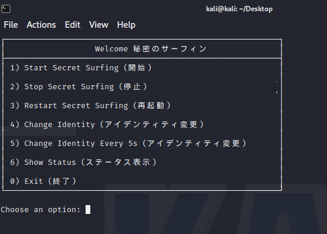

# ShadowSurf
[SS] 秘密のサーフィン  Anonymity Browsing

# How to Run?
✤ git clone https://github.com/deadrepo/Shadow-Surf.git

✤ cd folder

✤ chmod +x ./start.sh

# ShadowSurf
“Browse the web without leaving a trace.”

ShadowSurf is an advanced anonymity browsing tool that wraps your digital presence in layers of encryption and stealth. Built for those who take privacy seriously, it leverages the TOR network for ultra-secure routing, supports end-to-end encrypted tunnels, and introduces a unique feature: automated DNS rotation every 5 seconds, ensuring no pattern is ever traceable.
